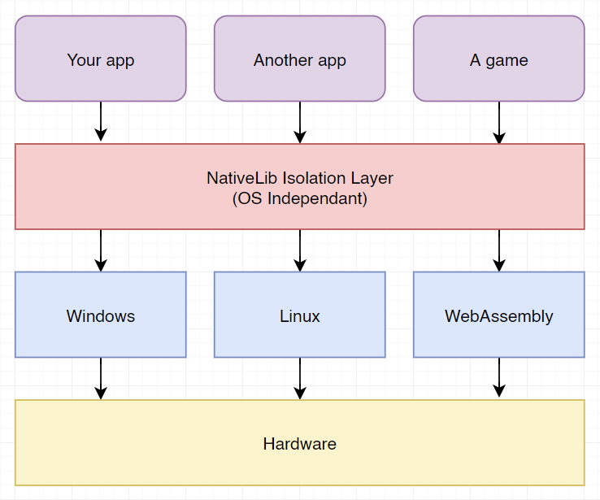

# [WIP] OS Independant Native Library
> This is a native library written in C++ for use on multiple platforms **\[WIP\]**. \
The library project files are generated using [Premake5](https://premake.github.io/download.html), which can generate projects for multiple platforms such as Windows (Visual Studio) and Linux (MAKE).

> Python 3.7+ is required for `publish.py` to run properly. This script copies the final binaries to `lib` folder. Python is also required to build the library for other platforms than Windows.

## Tested platforms
> ✔️ Windows (Visual Studio 2019 C++17) \
> ✔️ WebAssembly (EMScripten Compiler)

## Library features
- Container classes (Vector, Stack, LinkedStack, Queue, Map)
- String class
- Shared and Scoped RAII classes (similar to std shared_ptr and unique_ptr)
- File I/O abstraction
- Stream class
- Assertions
- JSON interactive objects (Parse, load and generate JSON)
- Logger abstraction
- Remote Procedure Calling (RPC) server using Named Pipes (Windows)
- Exceptions with stack trace
- Global allocators to trace memory
- Mathematical vectors (Vector2, Vector3 and Vector4)
- Token Parsing (Scanner for lexical analysis and such)
- Threading utilities (ReadWriteLock, Interlocked)
- System API Layer isolation
- Platform definitions

## Motivation
Provide a core isolated abstraction layer library for use in anything that wants more control of where and how its running. The idea is to not let loose the various system api calls hidden away in STL headers, but to route these to the library user instead, while providing common core functionality to help design a more stable and consistent codebase.

The name NativeLib comes from the idea of slim dependency on other libraries and the system itself, to see it as a native isolation layer where user builds app ontop.

The image below shows a visual idea of what NativeLib is designed for.

